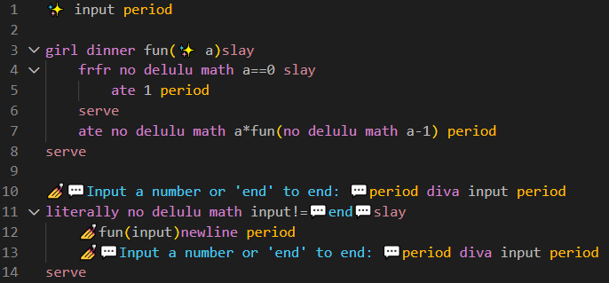

<div align="center">
  <h1>SlayGurl™ 💅💅💅</h1>
  
</div>

## How To Run
Make sure you are in the directory where the SGC.exe is or use a relative path, and type
```
$ ./SGC path/to/.sg/file 
```

## Theme
To run the custom theme, in VS code open the **sg_theme** folder, ther press **F5**. This will open a new VS code window in witch you can open your .sg files and see the slay gurl colors.


## Tokens
- **Cap** – negate (!)
- **💅** - printing to the console
- **✨** - declaring a variable
- **frfr/anyways** – if/else
- **slay/serve** - { }
- **literally** – while loop(literally keep going)
- **girl math** – a concept in where an expression returns a random number form 0 to the expression result. If the expression has a string in it, it returns a random float from 0 to 1.
- **no delulu math** - disables girl math for that expression
- **girl dinner** – declaring a function
- **ate** - return
- **period** – ending a statement (;)
- **diva** - input
- **💬** - string (“)

## Grammar
**Program** →Statements

**Statements** →Statement Statements |  €

**Statement** → Declare_var “period”
| Declare_var_assign “period”
| Var_assing “period”
| “💅” Expression “period”
| “diva” “variable” “period”
|If
| While
|Function  
|F_calls “period”
|”ate” Expression “period”

**Declare_var** → “✨” “variable”

**Declare_var_assign** → “✨” “variable” “=” Expression

**Var_assign** → “variable” “=” Expression

**F_calls** → “variable” “lparen” Args “rparen”

**Args** → “variable” | “variable” ”,” Args | €

**If** → “frfr” Expression “slay” Statements “serve” ("Else")?

**Else** -> "literally"" “slay” Statements “serve”

**While** → “literally” Expression “slay” Statements “serve”

**Function** → “girl dinner” “variable” “lparen” Declare_args “rparen” “slay” Statements “serve”

**Declare_args** → Declare_var | Declare_var, Declare_args | €

**Expression** →(no delulu math)? Logical

**Logical** → Comparison | Comparison (“and” | “or”) Logical

**Comparison** → Term | Term (“<” | “<=” | “>” | “>=” | “==”)

**Term** → Factor | Factor (“+” | “-”) Term

**Factor** → Unary | Unary (“*” | “/”|”%”) Factor

**Unary** → “cap” Unary | Primary

**Primary** → “INT” | “STRING” | “VARIABLE” | “lparen” **Expression** “rparen” | F_calls
